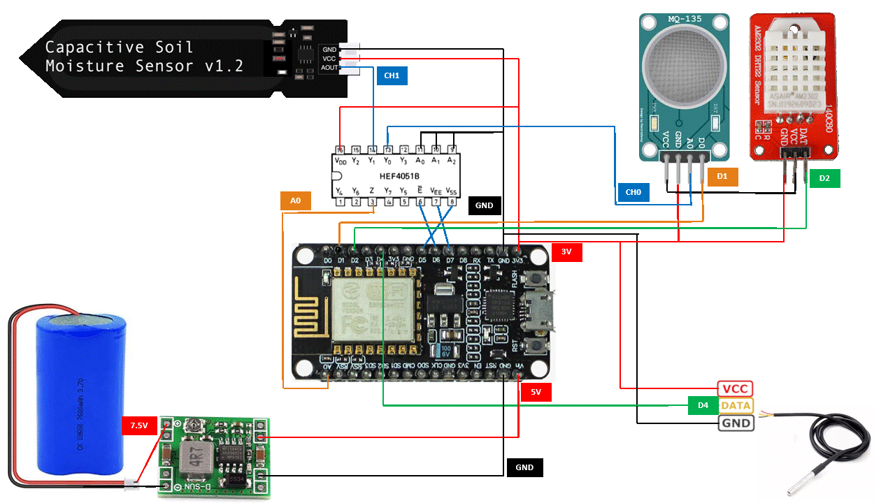

# IOT Device

```
ESP8266                   CD4051 (16-pin DIP, top view, notch at top)
                        +-------------------+
                        |o  CH4         VDD | → 3.3V
                        |   CH6         CH2 | → NC
A0 ←------------------→ |   COM         CH1 | → Soil Moisture AOUT
                        |   CH7         CH0 | → MQ135 AOUT
                        |   CH5         CH3 | → NC
D6 (GPIO12) ←---------→ |   INH           A | → GND
D7 (GPIO13) ←---------→ |   VEE           B | → GND
D5 (GPIO14) ←---------→ |   VSS           C | → GND
                        +-------------------+

MQ135:
- AOUT → CD4051 CH0 (Pin 13)
- DOUT → ESP8266 D1 (GPIO5)
- VCC → 3.3V
- GND → GND

Soil Moisture:
- AOUT → CD4051 CH1 (Pin 14)
- VCC → 3.3V
- GND → GND

DHT22:
- DATA → ESP8266 D2 (GPIO4)
- VCC → 3.3V
- GND → GND

DS18B20:
- DATA → ESP8266 D4 (GPIO2) + 4.7kΩ pull-up to 3.3V
- VCC → 3.3V
- GND → GND
```


